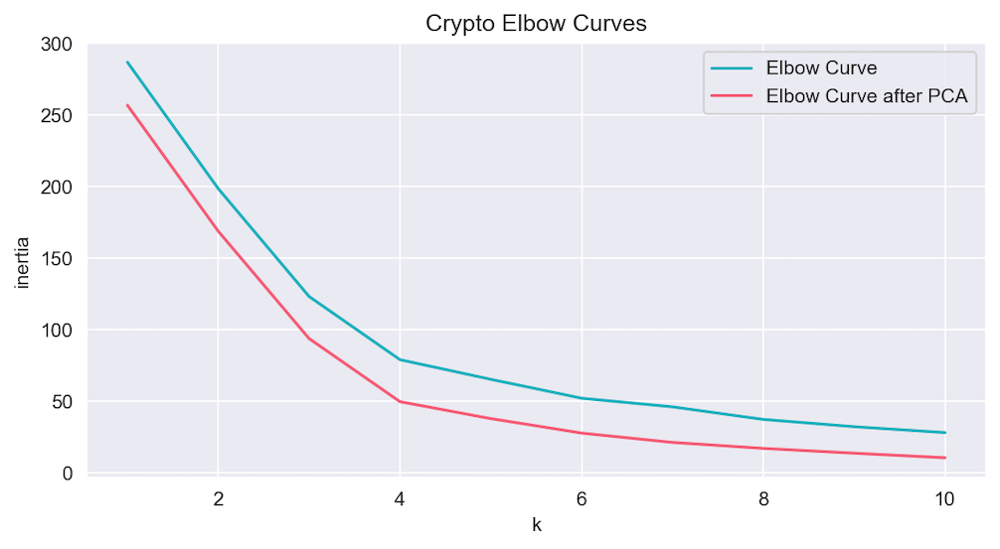

# Unsupervised Machine Learning Challenge
Use Python and Unsupervised Machine Learning to predict whether cryptocurrencies are affected by 24-hour or 7-day price changes.

Created and submitted for an assignment for Monash University Data Analytics Boot Camp (October 2023).


## Table of Contents

- [General info](#general-info)
- [Questions & Answers](#questions & answers)
- [Technologies](#technologies)
- [Screenshots](#screenshots)
- [Code example](#code-example)
- [References](#references)

## General info

### Crypto_Clustering.ipynb

- Original Dataset:
  - Imports Cryptocurrency CSV file as Pandas DataFrames.
  - Normalises data using `StandardScaler()` module from scikit-learn (a machine learning library for Python).
  - Finds best value for k (determined to be 4) by plotting "elbow curve" line chart using `hvplot.pandas`.
  - Clusters cryptocurrencies based on k = 4 clusters using KMeans.

- PCA Dataset
  - Performs PCA on the dataset using `pca.fit_transform()` module to reduce dimensionality to three principal components.
  - Calculates the total explained variance of the three principal components (determined to be 89.5%).
  - Finds best value for k (also determined to be 4) by plotting "elbow curve" line chart using `hvplot.pandas`.
  - Clusters cryptocurrencies based on k = 4 clusters using KMeans and `hvplot.pandas`.

### Resources Folder

- Contains: 
  - Raw data: crypto_market_data.csv
  - Cryptocurrency banner image and various chart screenshots.

## Questions & Answers

1. #### What is the best value for `k`?

   - The best value for `k` is `4`, because this is where the "elbow curve" is most acute.

2. #### What is the total explained variance of the three principal components?

   - The total explained variance of the three principal components is `89.5%`. This means that 89.5% of the overall variability is explained by the three principal components.

3. #### What is the best value for `k` when using the PCA data?

   - The best value for `k` is again `4`.

4. #### Does it differ from the best k value found using the original data?

   - No, it does not differ. This is expected as PCA should not alter the data in any meaningful way. PCA is used to reduce the dimensionality of the data.

5. #### After visually analysing the cluster analysis results, what is the impact of using fewer features to cluster the data using K-Means?

   - Using fewer features to cluster the data results in lower inertia, where the data elements are more concentrated. This means that the standard deviation for elements in a given cluster is small relative to the cluster mean value, which is desirable.

## Technologies

Project created and run using:

- Python 3.10.9
  - Pandas 1.5.3
  - Matplotlib 3.7.1
  - Seaborn 0.12.2
  - Scikit-Learn 1.3.0
  - Holoviews 1.17.0
  - hvplot 0.8.4
- Visual Studio Code 1.83.0


## Screenshots

#### Determining k values - Elbow Curves



#### Cryptocurrency Clusters - Scatter plots


## Code example

```python
## Code Snippet from citibike_data_cleaning.ipynb
#################################################

# Initialise the K-Means model using the best value for k
model = KMeans(n_clusters=4)

# Fit the K-Means model using the scaled data
model.fit(df_market_data_scaled)

# Predict the clusters to group the cryptocurrencies using the scaled data
crypto_clusters = model.predict(df_market_data_scaled)

# Print the resulting array of cluster values.
print(crypto_clusters)

# Create a copy of the DataFrame
df_market_data_scaled_predictions = df_market_data_scaled.copy()

# Add a new column to the DataFrame with the predicted clusters
df_market_data_scaled_predictions['CryptoCluster'] = crypto_clusters

# Display sample data
df_market_data_scaled_predictions.head()

# Create a scatter plot using hvPlot
scaled_scatter_plot = df_market_data_scaled_predictions.hvplot.scatter(
                        x="price_change_percentage_24h",
                        y="price_change_percentage_7d",
                        by="CryptoCluster",
                        hover_cols="coin_id",
                        title = "Crypto Scatter Plot")

scaled_scatter_plot
```

## References

- Code, in general, was adapted from Monash University Data Analytics Boot Camp 2023 course learning material.

Created and written by Samuel Palframan - October 2023.
